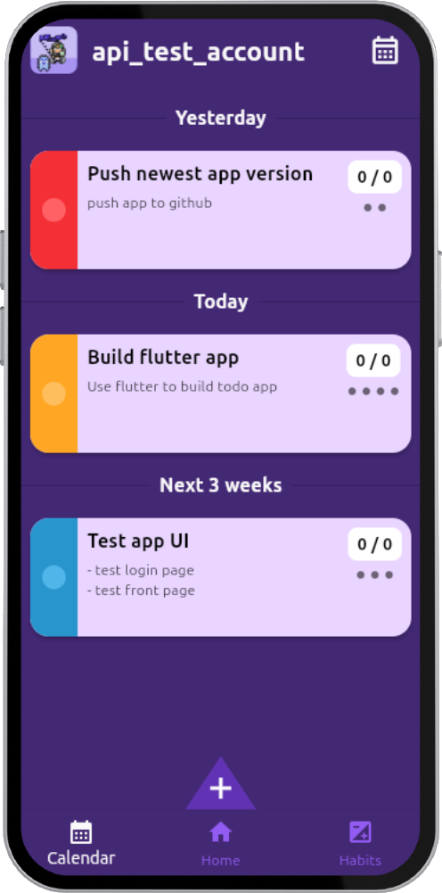
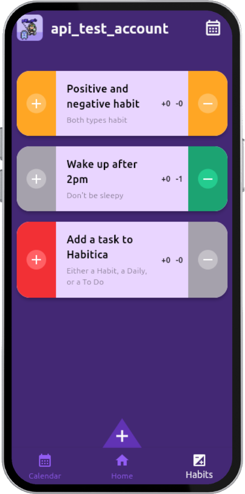

# Habit Tracker App

## Short Description
The Habit Tracker App is a Flutter-based mobile application designed to help users manage their daily tasks, habits, and to-dos effectively. It is using [Habitica API](https://habitica.com) API to track progress.

> **Note:** To use this app, you need an active Habitica account.

<p align="center">    </p> 


## Features
- **Customizable Tasks:** Tailor tasks with options for scheduling, difficulty, and repeat settings.
- **Swipe Actions:** Delete or complete tasks with swipe gestures.
- **Dynamic UI:** User-friendly interface designed for clarity and efficiency.

## How to Run
1. **Clone the Repository**  
   Clone this project to your local machine:
   ```bash
   git clone https://github.com/your-username/habit-tracker-app.git
   ```
2. **Install dependencies**
  ```bash
  cd habit-tracker-app
  flutter pub get
  ```
3. **Run app**
  ```bash  
  flutter run
  ```
